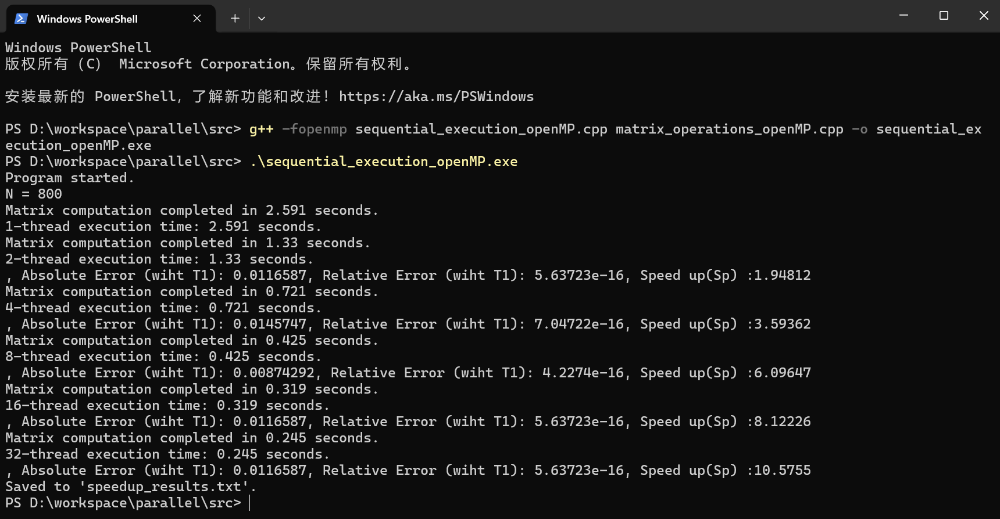
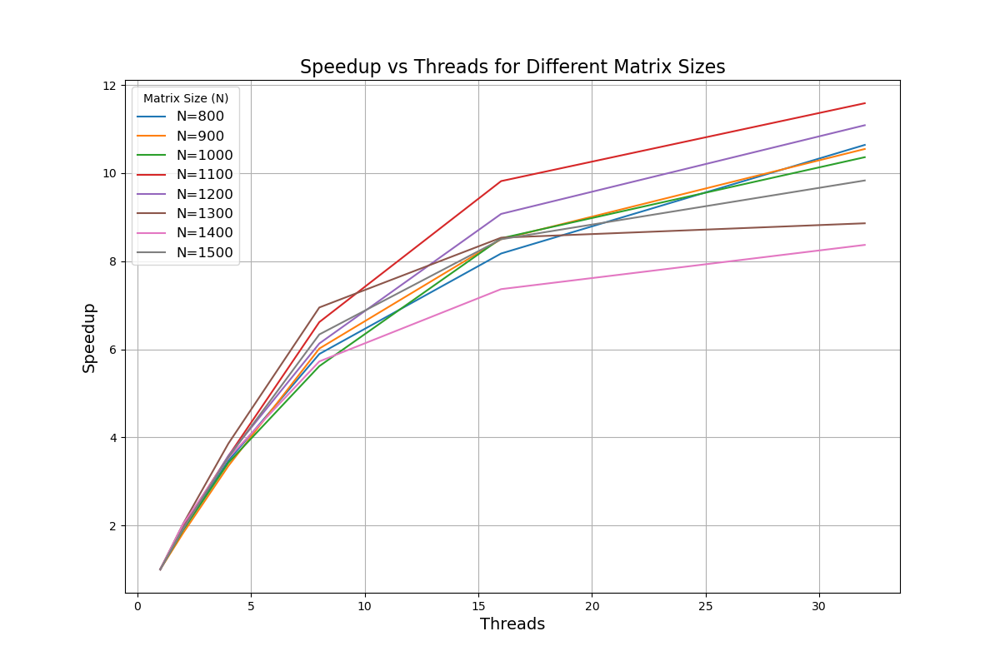
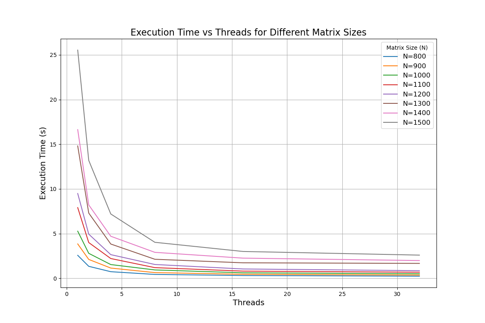

# Matrix Computation with OpenMP

### Студент
- Имя: Ван Цзыхань
- ST: st136731

# Задание A-10 (Цзыхань Ван)
=============================
```
Написать программу вычисления матричного выражения:

\[
A = B + C^2 + \text{Tr}(B) C^3 + I,
\]

где \(B\), \(C\) — квадратные плотные матрицы, элементы которых имеют тип `double`,  
\(I\) — единичная матрица, \(\text{Tr}(B)\) — след матрицы \(B\). Распараллелить эту  
программу с помощью OpenMP (parallel, task). Исследовать зависимость  
масштабируемости параллельной версии программы от её вычислительной  
трудоёмкости (размера матриц). Проверить корректность параллельной  
версии.

Проверка закона Амдала. Построить зависимость ускорение:число потоков для  
заданного примера.

Срок сдачи отчёта 26.11.2024.
```
=============================
```
Система: Windows 11
CPU: Intel Core i9-13900HX:
	1.Количество ядер: 24 ядра (8 производительных и 16 эффективных)
	2.Частота:
	    •Базовая: 2.6 ГГц
	    •Турбо: до 5.4 ГГц
	3.Потоки: 32 потока
	4.Кеш L3: 36 МБ
	5.TDP: 55 Вт
	6.Поддержка памяти: DDR4 до 3200 МГц, DDR5 до 4800 МГц
	7.Интегрированная графика: Intel UHD Graphics
```
=============================
## 1.структура содержания

```
parallel/
    └── src/
        ├── draw_result.py                  # ответственен за построение графиков результатов
        ├── matrix_operations_openMP.cpp    # Этот файл содержит операции с матрицами
        ├── matrix_operations_openMP.h      # 
        ├── sequential_execution_openMP.cpp # главная функция
        └── speedup_results.txt             # result

```
## 2.объяснение основных функций
```c
initializeMatrix() // Инициализация матрицы
identityMatrix() // Создание единичной матрицы
traceMatrix() // Вычисление следа матрицы
multiplyMatrices() // Умножение матриц
scalarMultiplyMatrix() // Умножение матрицы на скаляр
addMatrices() // Сложение матриц
compute_error() // Вычисление ошибки
relative_error() // Вычисление относительной ошибки
```

## 3.экспериментальный процесс
#### Примечание: Время работы программы не включает время инициализации матрицы.
### Компиляция и запуск основной функции
```
g++ -fopenmp -std=c++17 sequential_execution_openMP.cpp matrix_operations_openMP.cpp -o sequential_execution_openMP.exe
.\sequential_execution.exe
```
### Компиляция и запуск основной функции

```
PS D:\workspace\parallel\src> .\sequential_execution_openMP.exe
Program started.
N = 800
Matrix computation completed in 2.575 seconds.
1-thread execution time: 2.575 seconds.
Matrix computation completed in 1.344 seconds.
2-thread execution time: 1.344 seconds.
, Absolute Error (wiht 1-thread): 0.0116587, Relative Error (wiht 1-thread): 5.63723e-16, Speed up(Sp) :1.91592
Matrix computation completed in 0.742 seconds.
4-thread execution time: 0.742 seconds.
, Absolute Error (wiht 1-thread): 0.0145747, Relative Error (wiht 1-thread): 7.04722e-16, Speed up(Sp) :3.47035
Matrix computation completed in 0.437 seconds.
8-thread execution time: 0.437 seconds.
, Absolute Error (wiht 1-thread): 0.00874292, Relative Error (wiht 1-thread): 4.2274e-16, Speed up(Sp) :5.89245
Matrix computation completed in 0.315 seconds.
16-thread execution time: 0.315 seconds.
, Absolute Error (wiht 1-thread): 0.0116587, Relative Error (wiht 1-thread): 5.63723e-16, Speed up(Sp) :8.1746
Matrix computation completed in 0.242 seconds.
32-thread execution time: 0.242 seconds.
, Absolute Error (wiht 1-thread): 0.0174885, Relative Error (wiht 1-thread): 8.4561e-16, Speed up(Sp) :10.6405
N = 900
Matrix computation completed in 3.85 seconds.
1-thread execution time: 3.85 seconds.
Matrix computation completed in 2.116 seconds.
2-thread execution time: 2.116 seconds.
, Absolute Error (wiht 1-thread): 0.00934005, Relative Error (wiht 1-thread): 2.53816e-16, Speed up(Sp) :1.81947
Matrix computation completed in 1.149 seconds.
4-thread execution time: 1.149 seconds.
, Absolute Error (wiht 1-thread): 0.0186902, Relative Error (wiht 1-thread): 5.07907e-16, Speed up(Sp) :3.35074
Matrix computation completed in 0.64 seconds.
8-thread execution time: 0.64 seconds.
, Absolute Error (wiht 1-thread): 0.00934005, Relative Error (wiht 1-thread): 2.53816e-16, Speed up(Sp) :6.01563
Matrix computation completed in 0.453 seconds.
16-thread execution time: 0.453 seconds.
, Absolute Error (wiht 1-thread): 0.0140121, Relative Error (wiht 1-thread): 3.8078e-16, Speed up(Sp) :8.4989
Matrix computation completed in 0.365 seconds.
32-thread execution time: 0.365 seconds.
, Absolute Error (wiht 1-thread): 0.0186902, Relative Error (wiht 1-thread): 5.07907e-16, Speed up(Sp) :10.5479

...Полные данные представлены на графике

```
### Включает время вычислений каждого потока, а также ошибку по сравнению с результатами для одного потока. Поскольку матрицы содержат данные типа double, в параллельных вычислениях неизбежны различия, но ошибка находится в пределах допустимого. Далее на основе значения ускорения будет построен график.

| N    | Threads | Execution Time (s) | Speedup   | Absolute Error | Relative Error |
|------|---------|--------------------|-----------|----------------|----------------|
| 800  | 1       | 2.575              | 1         | 0              | 0              |
| 800  | 2       | 1.344              | 1.91592   | 0.0116587      | 5.63723e-16    |
| 800  | 4       | 0.742              | 3.47035   | 0.0145747      | 7.04722e-16    |
| 800  | 8       | 0.437              | 5.89245   | 0.00874292     | 4.2274e-16     |
| 800  | 16      | 0.315              | 8.1746    | 0.0116587      | 5.63723e-16    |
| 800  | 32      | 0.242              | 10.6405   | 0.0174885      | 8.4561e-16     |
| 900  | 1       | 3.85               | 1         | 0              | 0              |
| 900  | 2       | 2.116              | 1.81947   | 0.00934005     | 2.53816e-16    |
| 900  | 4       | 1.149              | 3.35074   | 0.0186902      | 5.07907e-16    |
| 900  | 8       | 0.64               | 6.01563   | 0.00934005     | 2.53816e-16    |
| 900  | 16      | 0.453              | 8.4989    | 0.0140121      | 3.8078e-16     |
| 900  | 32      | 0.365              | 10.5479   | 0.0186902      | 5.07907e-16    |
| 1000 | 1       | 5.274              | 1         | 0              | 0              |
| 1000 | 2       | 2.796              | 1.88627   | 0.0142449      | 2.21486e-16    |
| 1000 | 4       | 1.54               | 3.42467   | 0.0142449      | 2.21486e-16    |
| 1000 | 8       | 0.939              | 5.61661   | 0.0142449      | 2.21486e-16    |
| 1000 | 16      | 0.619              | 8.52019   | 0.0142449      | 2.21486e-16    |
| 1000 | 32      | 0.509              | 10.3615   | 0.0142449      | 2.21486e-16    |
| 1100 | 1       | 7.914              | 1         | 0              | 0              |
| 1100 | 2       | 4.002              | 1.97751   | 0.125082       | 1.23679e-15    |
| 1100 | 4       | 2.214              | 3.57453   | 0.125082       | 1.23679e-15    |
| 1100 | 8       | 1.196              | 6.61706   | 0.166777       | 1.64907e-15    |
| 1100 | 16      | 0.806              | 9.81886   | 0.166777       | 1.64907e-15    |
| 1100 | 32      | 0.683              | 11.5871   | 0.145927       | 1.44291e-15    |
| 1200 | 1       | 9.491              | 1         | 0              | 0              |
| 1200 | 2       | 4.945              | 1.91931   | 0              | 0              |
| 1200 | 4       | 2.65               | 3.58151   | 0.088492       | 5.54975e-16    |
| 1200 | 8       | 1.548              | 6.13114   | 0.088492       | 5.54975e-16    |
| 1200 | 16      | 1.046              | 9.07361   | 0.088492       | 5.54975e-16    |
| 1200 | 32      | 0.856              | 11.0876   | 0.0589999      | 3.70016e-16    |
| 1300 | 1       | 14.815             | 1         | 0              | 0              |
| 1300 | 2       | 7.301              | 2.02917   | 0.0812701      | 3.43575e-16    |
| 1300 | 4       | 3.838              | 3.86008   | 0              | 0              |
| 1300 | 8       | 2.132              | 6.94887   | 0.0812701      | 3.43575e-16    |
| 1300 | 16      | 1.736              | 8.53399   | 0              | 0              |
| 1300 | 32      | 1.672              | 8.86065   | 0              | 0              |
| 1400 | 1       | 16.639             | 1         | 0              | 0              |
| 1400 | 2       | 8.214              | 2.02569   | 0.163935       | 4.92476e-16    |
| 1400 | 4       | 4.707              | 3.53495   | 0.491809       | 1.47744e-15    |
| 1400 | 8       | 2.907              | 5.72377   | 0.437178       | 1.31332e-15    |
| 1400 | 16      | 2.259              | 7.36565   | 0.437178       | 1.31332e-15    |
| 1400 | 32      | 1.988              | 8.36972   | 0.491809       | 1.47744e-15    |
| 1500 | 1       | 25.536             | 1         | 0              | 0              |
| 1500 | 2       | 13.195             | 1.93528   | 0.288026       | 5.96588e-16    |
| 1500 | 4       | 7.199              | 3.54716   | 0.432053       | 8.94912e-16    |
| 1500 | 8       | 4.03               | 6.33648   | 0.576054       | 1.19318e-15    |
| 1500 | 16      | 3.005              | 8.49784   | 0.504033       | 1.044e-15      |
| 1500 | 32      | 2.597              | 9.83288   | 0.648061       | 1.34233e-15    |


### Построение графиков с использованием matplotlib


## Amdahl's Law
\[
S(p) = \frac{1}{(1 - P) + \frac{P}{n}}
\]
### Когда количество потоков (n) постепенно увеличивается, ускорение стремится к определенному значению.

## 4.экспериментальные выводы
    •Ускорение (Speedup) увеличивается с увеличением числа потоков: С увеличением числа потоков все размеры матриц (N) показывают рост ускорения. днако, когда количество потоков продолжает увеличиваться, ускорение стабилизируется. Чтобы продолжить увеличение ускорения, необходимо увеличить параллельные части программы, чтобы повысить ускорение.
    •Время выполнения (Execution Time) уменьшается с увеличением числа потоков: График времени выполнения показывает, что с увеличением числа потоков от 1 к большему значению, время выполнения всех матриц значительно сокращается. Особенно для больших матриц (например, N=1400 и N=1500), где время выполнения почти стабилизируется на высоких значениях числа потоков.
    •Более большие матрицы показывают более выраженный эффект: Для больших матриц (например, N=1200, N=1300, N=1400 и N=1500), увеличение числа потоков приводит к более заметным изменениям в ускорении и времени выполнения. Это показывает, что большие матрицы могут более эффективно использовать преимущества параллельных вычислений.

